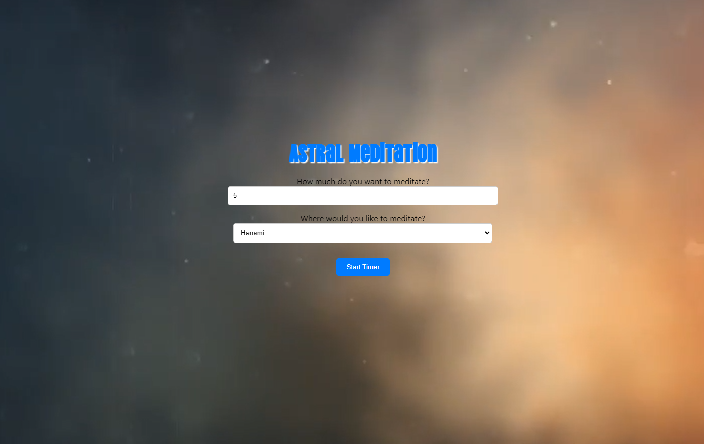

# AstralMeditation
A react-based WebApp for meditation

## Features:
-Choose your meditation Room
-Choose your meditation Time

## How to Use:
Go here [Astral Meditation](https://emanuelepardini.altervista.org/AstralMeditation/index.html).
-Select a Room and the time and enter the Room!

## Technologies Used:

-ReactJS
-JSX
-CSS

## Author:

This web app was created by [Emanuele Pardini](http://emanuelepardini.altervista.org/).
Enjoy!
